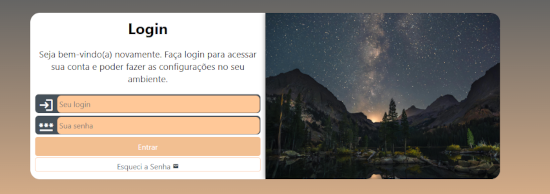

<div align="center">
  

  # 🚀 Portfólio Profissional | Karla Renata

  **Vendas | Negócios | Análise de Dados**

  <a href="https://www.linkedin.com/in/karlarenata-rosario/" target="_blank">
    
  </a>
  <a href="mailto:karlarenata692@gmail.com" target="_blank">
    
  </a>
  
  <br><br>

  <h3>
    🔗 <a href="https://karlarenatadev.github.io/portfolio-karla-renata/" target="_blank">Visite a Versão Online do Portfólio</a>
  </h3>
</div>

---

## 👩‍💻 Sobre Mim

Olá! Sou **Karla Renata**. Estou unindo minha sólida experiência em **vendas e estratégia comercial** com o poder da tecnologia. 

Atualmente cursando **Ciência da Computação**, meu foco é a **Análise de Dados**. Minha trajetória me ensinou que dados sem contexto são apenas números; meu diferencial é usar minha visão de negócios para transformar esses números em *histórias* e *estratégias* que geram lucro e eficiência.

🛠 **Stack Principal:** Python (Pandas/NumPy), SQL, Power BI, Excel Avançado e Git.

---

## 📊 Minhas Estatísticas no GitHub

<div align="center">
  
  
</div>

---

## 📂 Projetos em Destaque

### 📈 Análise de Dados & BI
| Projeto | Solução / Impacto | Stack | Link |
| :--- | :--- | :--- | :---: |
| **Risco de Crédito** | Identificação de padrões de inadimplência para mitigar riscos financeiros. | `Python` `Pandas` `Seaborn` | <a href="https://github.com/karlarenatadev/analise-de-dados-credito" target="_blank">Ver no GitHub</a> |
| **Dashboard de Vendas** | Painel interativo para monitoramento de KPIs comerciais e regionais. | `Power BI` `DAX` `ETL` | <a href="https://github.com/karlarenatadev/dashboard-vendas-power-bi" target="_blank">Ver no GitHub</a> |
| **Automação RPA** | Robô para automação de cadastro de produtos em ERP com validação de dados. | `Python` `PyAutoGUI` `Pandas` | <a href="https://github.com/karlarenatadev/automacao-pyautogui" target="_blank">Ver no GitHub</a> |

### 💻 Desenvolvimento Web
| Projeto | Descrição | Stack | Link |
| :--- | :--- | :--- | :---: |
| **Portfólio Pessoal** | Hub central de projetos com suporte multi-idioma e design responsivo. | `JS` `HTML` `CSS` | <a href="https://karlarenatadev.github.io/portfolio-karla-renata/" target="_blank">Acessar Online</a> |
| **Login Page** | Interface moderna com validação de formulário e dark mode. | `CSS3` `HTML5` | <a href="https://karlarenatadev.github.io/projeto-login/" target="_blank">Acessar Online</a> |

---

## ✨ Funcionalidades do Portfólio

Este projeto não é apenas estático; ele demonstra conhecimentos em lógica de programação e UX:

* **🎨 Responsividade Total:** Layout adaptável via Media Queries.
* **🇺🇸/🇧🇷 Internacionalização:** Sistema de troca de idioma em tempo real usando **JavaScript DOM**.
* **📄 Download de CV:** Acesso direto ao currículo em PDF.

---

## 🛠️ Tecnologias Utilizadas


---

## 🚀 Como Executar Localmente

1. **Clone o repositório:**
   ```bash
   git clone [https://github.com/karlarenatadev/portfolio-karla-renata.git](https://github.com/karlarenatadev/portfolio-karla-renata.git)

2. **Entre na pasta:**
    ```bash
    cd portfolio-karla-renata

3. **Execute: Abra o arquivo index.html no seu navegador ou use o Live Server do VS Code.**